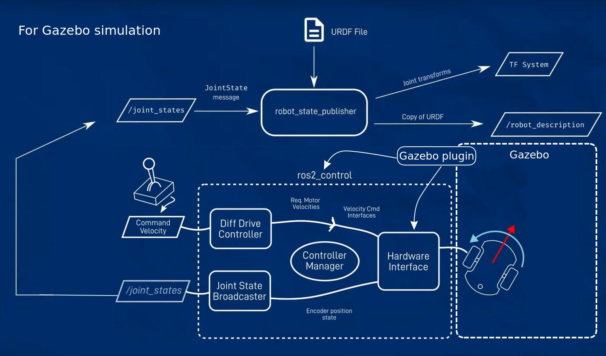

# ros2_control_example
This repo is a learning note for using of ros2_control package with Gazebo hardware interface.

The learning material:

`ArticulatedRobotics` https://www.youtube.com/@ArticulatedRobotics/videos

`The Construct` https://www.theconstructsim.com/

### Write a custom controller
Check controller packages in `src`, three controllers example are provided.

1. my_controller - basic command forward controller.
2. my_controller2 - same as my_controller but with custom message implementation.
3. multi_link_controller - PID based multi-link robot arm controller.

### Demonstration of multi_link_controller
#### 1. Open Gazebo simulation
```
ros2 launch robot_model gazeobo_sim.launch.py
```
#### 2. Loads, configures and start a controller on startup
```
ros2 run controller_manager spawner multi_link_controller
```
#### 3. Send control command through topic
##### a. control first arm to 270°
```
ros2 topic pub --once /multi_link_controller/commands custom_interfaces/msg/MultiLinkPos "{joint_names: ["arm_joint1", "arm_joint2"], values: [4.71, 1.57], controllable: [true, false]}"
```


##### b. control first arm to 150° Control first arm and second arm to 180°
```
ros2 topic pub --once /multi_link_controller/commands custom_interfaces/msg/MultiLinkPos "{joint_names: ["arm_joint1", "arm_joint2"], values: [2.62, 0.52], controllable: [true, true]}"
```


#### 4. Controller reaction to perturbation


# Gazebo and ros2_control pipeline
