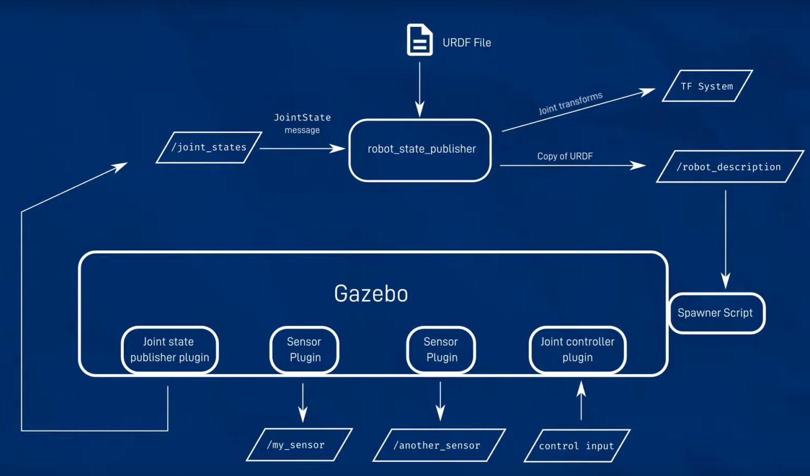

# ros2_control_example
a simple example for usage of ros2_control package

# Source setup.bash
```
source install/setup.bash
```

# Display URDF model in rviz2


robot_model/robot_state_publisher_launch.py is a launch file to load urdf.xml to robot_state_publisher.

```
ros2 launch robot_model robot_state_publisher_launch.py
```

use joint_state_publisher_gui to settle TF of joints.

```
ros2 run joint_state_publisher_gui joint_state_publisher_gui
```

now we can check robot model in rviz2.

# Display robot model in Gazebo


robot_model/gazeobo_sim.launch.py is a launch file for simulation in Gazebo.

```
ros2 launch robot_model gazeobo_sim.launch.py
```

we can publish /set_joint_trajectory topic to control joint trajectory in Gazebo (then it will reflect back to rviz2 consequently).
```
ros2 topic pub -1 /set_joint_trajectory trajectory_msgs/msg/JointTrajectory  '{header: {frame_id: world}, joint_names: [arm_joint], points: [  {positions: {0.6}} ]}'
```
