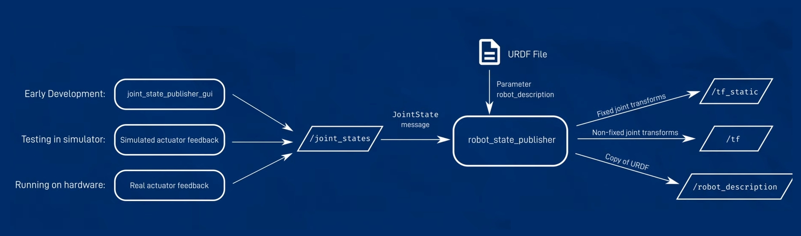

# ros2_control_example
a simple example for usage of ros2_control package

# Source setup.bash
```
source install/setup.bash
```

# Display URDF model in rviz2


robot_model/robot_state_publisher_launch.py is a launch file to load urdf.xml to robot_state_publisher.

```
ros2 launch robot_model robot_state_publisher_launch.py
```

use joint_state_publisher_gui to settle TF of joints.

```
ros2 run joint_state_publisher_gui joint_state_publisher_gui
```

now we can check robot model in rviz2.
