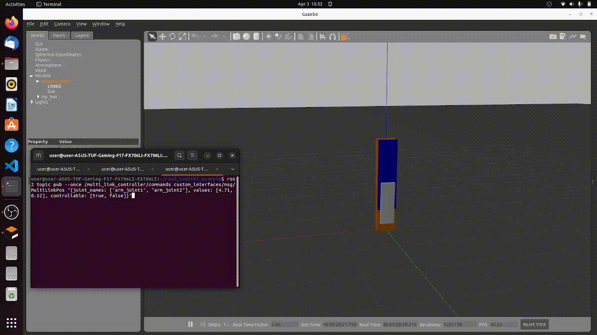
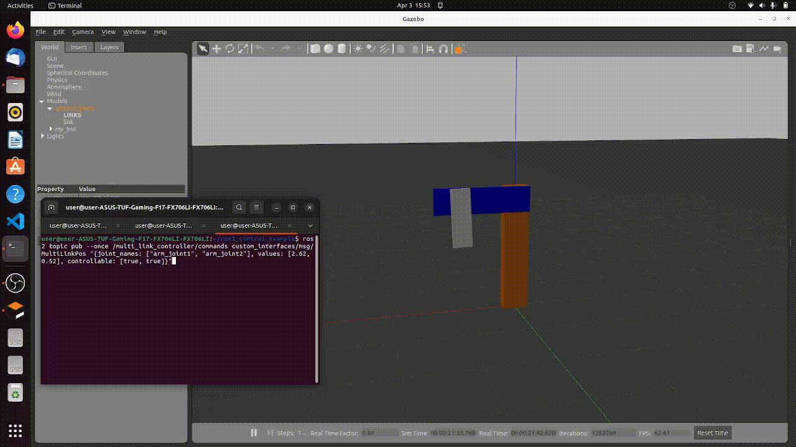
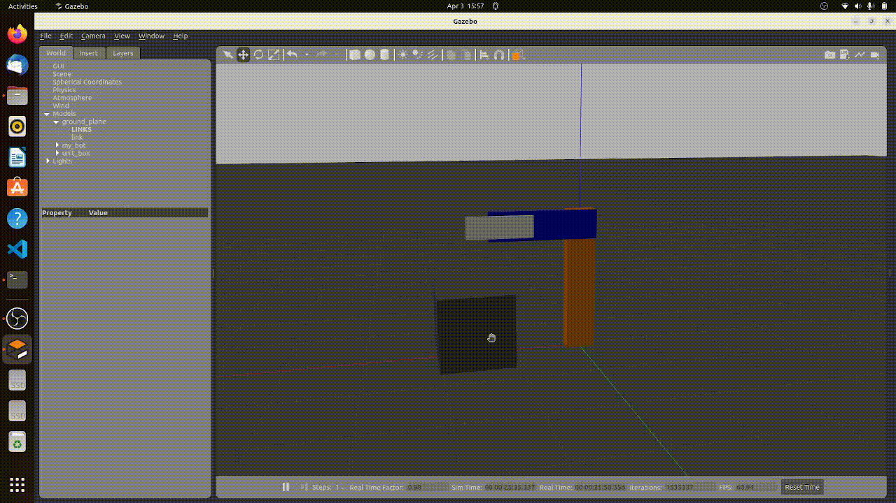

# ros2_control_example
A simple example for using of ros2_control package with Gazebo hardware interface.

### Write a custom controller
Check controller packages in `src`, three controllers example are provided.

1. my_controller - basic command forward controller.
2. my_controller2 - same as my_controller but with custom message implementation.
3. multi_link_controller - PID based multi-link robot arm controller.

### Demonstration of multi_link_controller
#### 1. Open Gazebo simulation
```
ros2 launch robot_model gazeobo_sim.launch.py
```
#### 2. Loads, configures and start a controller on startup
```
ros2 run controller_manager spawner multi_link_controller
```
#### 3. Send control command through topic
##### a. control first arm to 270°
```
ros2 topic pub --once /multi_link_controller/commands custom_interfaces/msg/MultiLinkPos "{joint_names: ["arm_joint1", "arm_joint2"], values: [4.71, 1.57], controllable: [true, false]}"
```



##### b. control first arm to 150° Control first arm and second arm to 180°
```
ros2 topic pub --once /multi_link_controller/commands custom_interfaces/msg/MultiLinkPos "{joint_names: ["arm_joint1", "arm_joint2"], values: [2.62, 0.52], controllable: [true, true]}"
```


#### 4. Controller reaction to perturbation


# Source setup.bash
```
source install/setup.bash
```

# Display URDF model in rviz2


robot_model/robot_state_publisher_launch.py is a launch file to load urdf.xml to robot_state_publisher.

```
ros2 launch robot_model robot_state_publisher_launch.py
```

use joint_state_publisher_gui to settle TF of joints.

```
ros2 run joint_state_publisher_gui joint_state_publisher_gui
```

now we can check robot model in rviz2.

# Display robot model in Gazebo


robot_model/gazeobo_sim.launch.py is a launch file for simulation in Gazebo.

```
ros2 launch robot_model gazeobo_sim.launch.py
```

we can publish /set_joint_trajectory topic to control joint trajectory in Gazebo (then it will reflect back to rviz2 consequently).
```
ros2 topic pub -1 /set_joint_trajectory trajectory_msgs/msg/JointTrajectory  '{header: {frame_id: world}, joint_names: [arm_joint], points: [  {positions: {0.6}} ]}'
```

# Ros2 command publish
ros2 topic pub --once /my_controller/commands control_msgs/msg/JointJog "{joint_names: ["arm_joint1", "arm_joint2"], displacements: [0.1, -0.1]}"

ros2 topic pub --once /multi_link_controller/commands custom_interfaces/msg/MultiLinkPos "{joint_names: ["arm_joint1", "arm_joint2"], values: [1.5, 0.5], controllable: [false, false]}"

# Task 1
create a custom interface for communication between user and controller.

# Task 2
create my_controller2, same as my_controller but utilize the new created interface.

Good PID constant for first link
  float P_ = 1.6;
  float I_ = 0.06;
  float D_ = 0.7;
  
